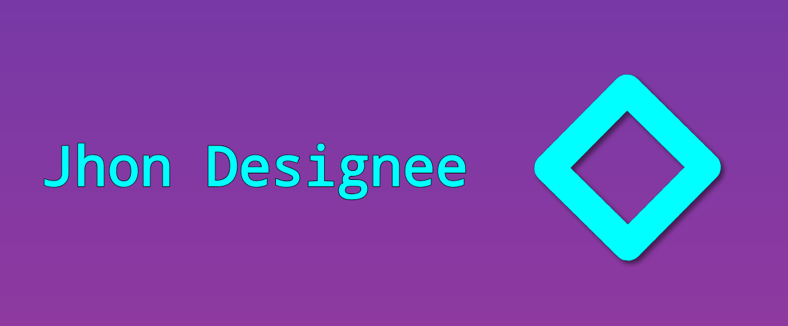

  😃 Jhonata  
  🎉 19 yo  
  👨‍💻 Web developer  
  🇧🇷 Brasileiro 

<em>Focado em experiência no mobile</em>

  

  

---

  
  
  
  

  <picture>
    <source media="(prefers-color-scheme: dark)" srcset="https://raw.githubusercontent.com/jhondesignee/jhondesignee/output/github-snake-dark.svg" />
    <source media="(prefers-color-scheme: light)" srcset="https://raw.githubusercontent.com/jhondesignee/jhondesignee/output/github-snake.svg" />
    
  </picture>

